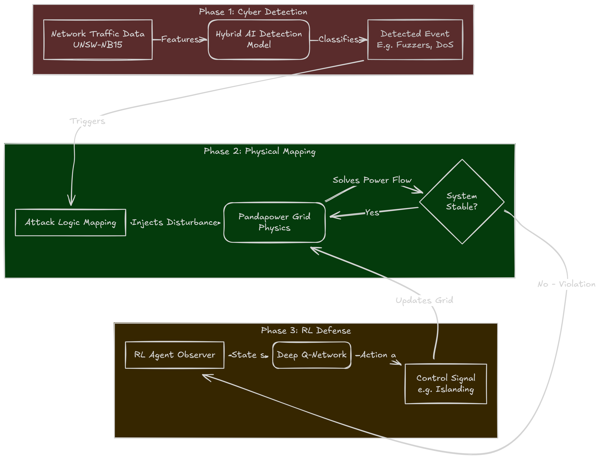

# EcoGuard: A Deep Reinforcement Learning Framework for Resilient and Sustainable Smart Grids

This project implements a **Cyber-Physical Digital Twin** for power grids to simulate and mitigate cyber-attacks using **Deep Reinforcement Learning (RL)**. It demonstrates how AI can autonomously stabilize grids against threats like **FDIA (False Data Injection)** and **Ransomware**, ensuring reliability for sustainable energy networks.


## System Architecture

The framework consists of three integrated phases creating a complete **Cyber-Physical Loop**.

### 1. Cyber-Attack Detection (Phase 1)
- **Input**: Network traffic data (UNSW-NB15 Dataset).
- **Model**: A **Hybrid Graph Neural Network (GNN)** and Deep Learning classifier.
- **Function**: Detects malicious patterns (e.g., Fuzzers, DoS, Reconnaissance) from raw network logs.
- **Output**: The specific attack type identified, which triggers the corresponding physical scenario.

### 2. Cyber-Physical Simulation (Phase 2)
- **Engine**: `pandapower` (based on Newton-Raphson Power Flow).
- **Mapping**: Converts the detected cyber-threat into a **physical grid event**.
    - *Example*: A "Fuzzer" attack is mapped to random noise injection in load sensors.
    - *Example*: "DoS" is mapped to communication loss, preventing remote control of breakers.
- **Digital Twin**: Simulates the grid's electrical response (Voltage, Current, Frequency) to these disturbances.

### 3. Resilient Control (Phase 3)
- **Agent**: A **Deep Q-Network (DQN)** Reinforcement Learning agent.
- **Observation**: Monitors the "Digital Twin" state (Bus Voltages, Line Loading).
- **Action**: Autonomously executes grid maneuvers (Island Microgrid, Shed Load, Switch Capacitor) to restore stability.



## Experimental Results

The following table summarizes the performance of the RL Agent compared to a baseline (no defense) across 10 distinct scenarios and grid topologies.

**Key Metrics:**
*   **Avg_Volt**: Average bus voltage (Target: 1.0 p.u.).
*   **Violations**: Number of safety violations (< 0.9 p.u.).
*   **RMSE**: Root Mean Square Error from nominal voltage (Lower is better).
*   **Improvement**: Percentage reduction in voltage deviation.

### Research Metrics Table

| Scenario | Grid | Avg Volt (Base) | Avg Volt (RL) | Violations (Base) | Violations (RL) | RMSE (Base) | RMSE (RL) | Resilience Improv. (%) |
| :--- | :--- | :--- | :--- | :--- | :--- | :--- | :--- | :--- |
| **1** | IEEE 13 | 0.886 | **0.952** | 3 | **2** | 0.281 | **0.111** | 60.48% |
| **2** | IEEE 33 | 0.901 | **0.969** | 2 | **0** | 0.261 | **0.032** | 87.85% |
| **3** | IEEE 300 | 0.844 | 0.844 | 3 | 3 | 0.450 | 0.450 | 0.00% |
| **4** | IEEE 118 | 0.985 | 0.985 | 0 | 0 | 0.015 | 0.015 | 0.00% |
| **5** | CIGRE MV | 0.857 | **0.987** | 3 | **0** | 0.366 | **0.019** | 94.84% |
| **6** | GB Network | 0.727 | **0.835** | 15 | 15 | 0.395 | **0.166** | 58.02% |
| **7** | IEEE 13 | 0.828 | **0.960** | 3 | **1** | 0.380 | **0.106** | 72.00% |
| **8** | IEEE 33 | 0.772 | **0.968** | 4 | **0** | 0.448 | **0.032** | 92.88% |
| **9** | IEEE 118 | 0.985 | 0.985 | 0 | 0 | 0.015 | 0.015 | 0.00% |
| **10** | CIGRE MV | 0.985 | **0.989** | 2 | **0** | 0.025 | **0.016** | 37.43% |


## Project Structure

- `phase1.ipynb`: Contains the Phase 1 implementation for training the Cyber-Attack Detection Ensembling Models.
- `grid_models.py`: Handles grid topology generation (IEEE 13, 33, 123, 118, 300, GB, SimBench).
- `attack_logic.py`: Contains the logic for targeting critical assets and applying physical attacks (FDI, Ransomware).
- `visualization.py`: Provides advanced plotting for cascading failures and grid restoration.
- `phase2_sim.py`: Runs the Phase 2 simulation loop (Attack Simulation).
- `phase3_defense.py`: Runs the Phase 3 training loop (RL Defense).
- `main.py`: The single entry point for running the project.
- `run_custom_scenarios.py`: Batch runner for generating results across 10 scenarios.
- `generate_research_metrics.py`: Calculates quantitative metrics for the paper.

## Key Features

- **Dynamic Targeting**: Works on ANY grid topology without hardcoded indices.
- **Closed-Loop Physics**: Actions (Load Shedding, Capacitor Switching) physically modify the grid model and trigger a fresh Power Flow solution.
- **Deterministic Simulation**: Random seeds are synchronized across Attack and Defense phases to ensure fair comparison.
- **Advanced Visualization**: Generates publication-ready time-series plots with shaded resilience regions.

## Installation & Usage

1.  **Install Dependencies**:
    ```bash
    pip install pandapower pandas numpy matplotlib seaborn simbench
    ```

2.  **Run Simulation**:
    To reproduce the results above, run the automated scenario manager:
    ```bash
    python run_custom_scenarios.py
    ```

    Or run individual phases:
    ```bash
    # Phase 2: Attack Simulation
    python main.py --phase 2 --grid ieee13 --steps 20

    # Phase 3: Defense Training
    python main.py --phase 3 --grid ieee13 --episodes 1000
    ```
